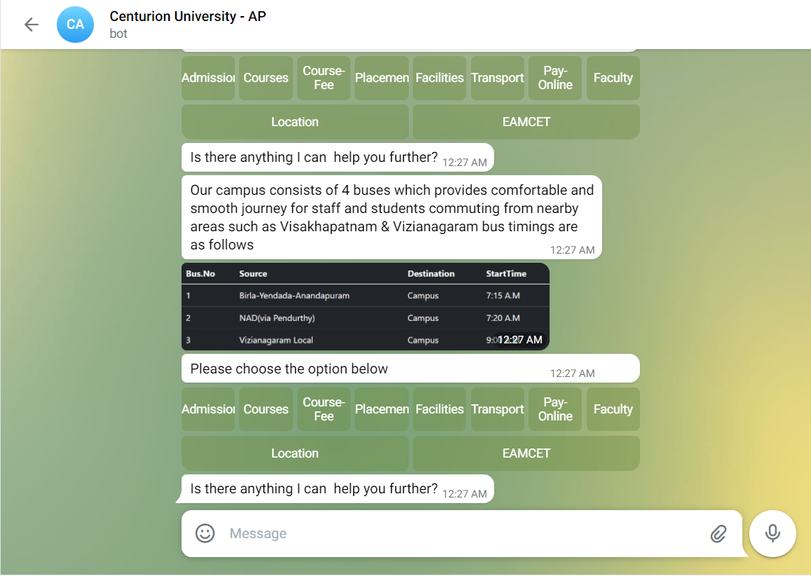
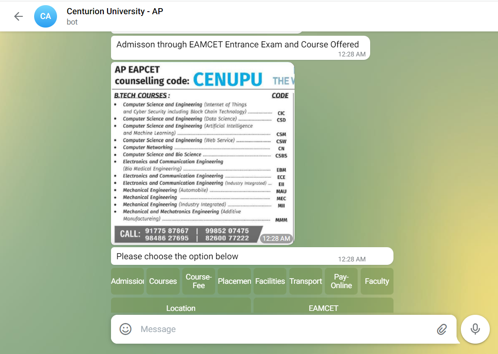

# CUBAP-Telegram-Bot
Centurion University Andhra Pradesh information bot using Rasa Framework
Framework used for bootstrapping conversational chatbot
Components:-
<ul>
  <li>RASA NLU</li>
  <li>RASA CORE</li>
 </ul>

* [Screenshots](#screenshots)
* [Technologies](#technologies)

## Screenshots

   
   
   
   

## Technologies

<ul>
  <li>RASA Framework</li>
  <li>Spacy Library</li>
  <li>YAML</li>
  </ul>

